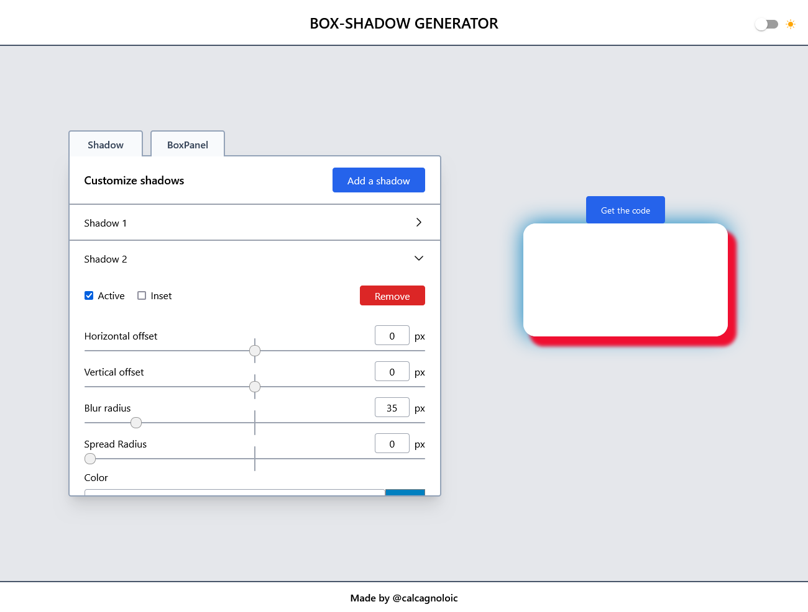

    

<h1 align="center">
    Box-shadow generator
</h2>

    <a href=""> View Demo 

    
    
    
    

## About the project

    

This project was completed as part of my online training on [react](https://www.udemy.com/course/react-formation-complete/). The design was entirely done using TailwindCSS.

In this project, I was able to use all the skills acquired in react, including :

-   Hooks (`useState()`, `useEffect()`, `useContext()`, `useSelector()`, `useDispatch()`)
-   State management with `redux-toolkit`
-   Build a dark mode
-   Build a modal with `createPortal()`

